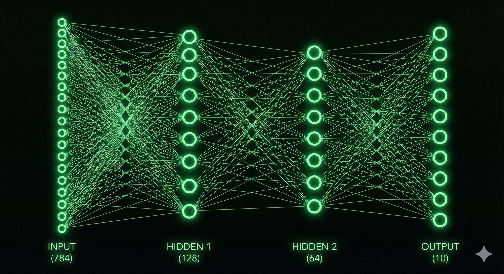

# MNIST Classification with a Fully Connected Neural Network (NumPy)
This project implements a from-scratch fully connected neural network in NumPy to classify handwritten digits from the MNIST dataset, without using high-level deep learning frameworks such as TensorFlow or PyTorch.

Neural Network Architecture

• Type: Feedforward Fully Connected Neural Network (Multilayer Perceptron)
• Input layer: 784 neurons (28×28 flattened grayscale images)
• Hidden layer 1: 128 neurons, ReLU activation 
• Hidden layer 2: 64 neurons, ReLU activation
• Output layer: 10 neurons, Softmax activation
• Total layers: 4 (including input layer)
• Loss function: Categorical Cross-Entropy
• Optimizer: Mini-batch Gradient Descent
• Weight initialization: He-style scaled random initialization

Features

• Automatic download of the MNIST dataset from reliable mirrors
• Data normalization and vectorized training
• Mini-batch training with configurable batch size, learning rate, and epochs
• Training and test accuracy reporting
• Interactive visualization of misclassified test images using matplotlib buttons

Libraries Used
• NumPy – numerical computations and neural network implementation
• Matplotlib – training visualization and interactive misclassification viewer
• urllib / gzip / os – dataset downloading and preprocessing utilities

Goal
Purely educational: to demonstrate how a neural network for image classification can be built entirely from scratch, while maintaining good performance and full transparency of the learning process.
